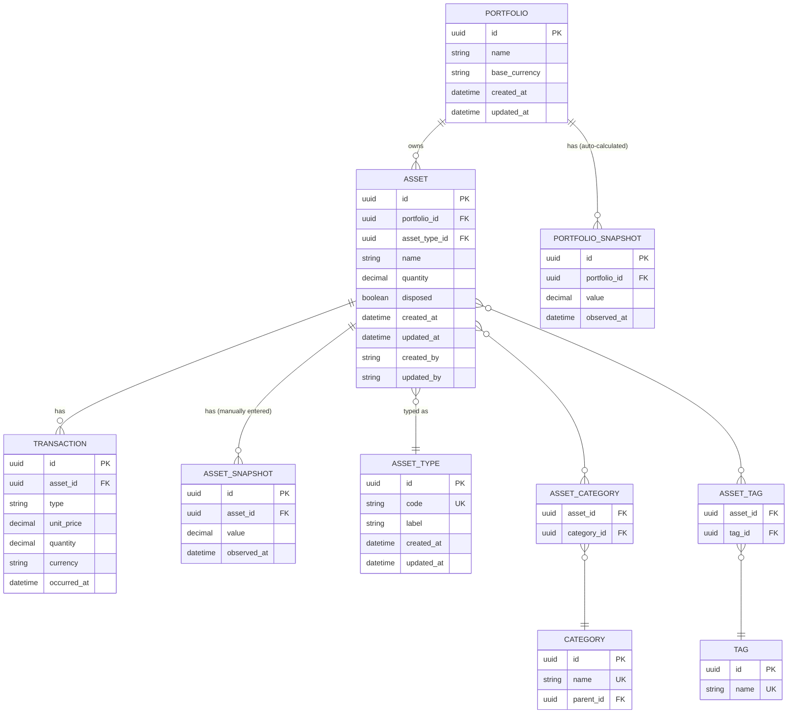
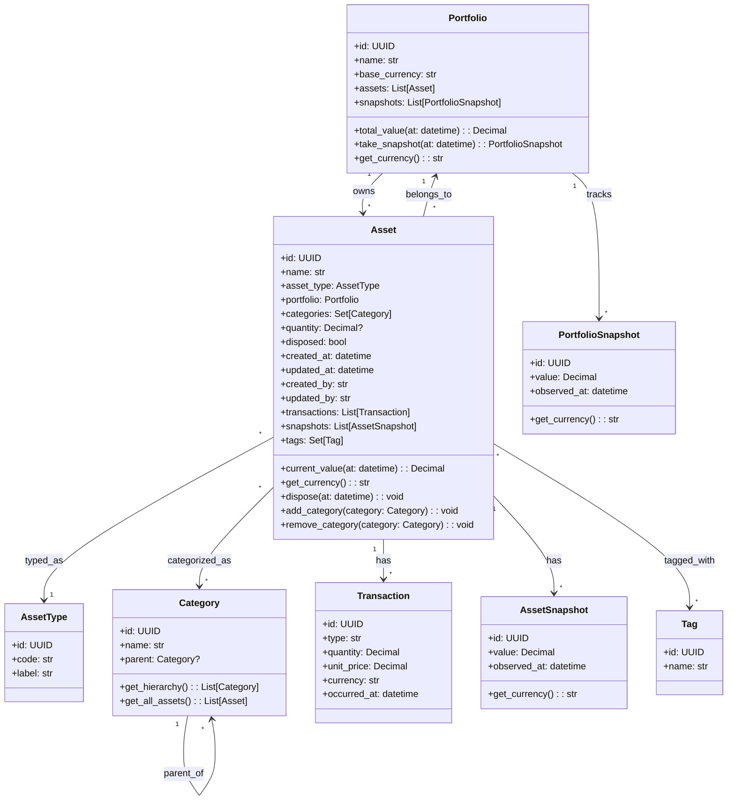

# Data Model

## Entity-Relationship Diagram (Database / ORM)

👉 Persistence-oriented

## Conceptual Data Model

👉 Behavior-oriented

## Transaction Types

- `ACQUIRE`: Buying/receiving an asset (increases quantity)
- `DISPOSE`: Selling/giving away an asset (decreases quantity)
- `ADJUST`: Manual correction/adjustment